# Beacon

## Specifying Architecture

### Client Views

#### Home

The Home screen is the first screen that the user will see after logging in. This screen has four view components and one connector component. The views will take in their specified data and output a view that the user can interact with. These views will also initiate actions that are specified in a section below. There is also a connector component that shares data between multiple components.

| Component name   | UI                                                                                                                                            | Description                                                                                                                                                                    | Inputs                                                                                                                                                                                                                                                                                              | Outputs                                                                                                                                                                                                                                                                      | Owner   |
| ---------------- | --------------------------------------------------------------------------------------------------------------------------------------------- | ------------------------------------------------------------------------------------------------------------------------------------------------------------------------------ | --------------------------------------------------------------------------------------------------------------------------------------------------------------------------------------------------------------------------------------------------------------------------------------------------- | ---------------------------------------------------------------------------------------------------------------------------------------------------------------------------------------------------------------------------------------------------------------------------- | ------- |
| map              | 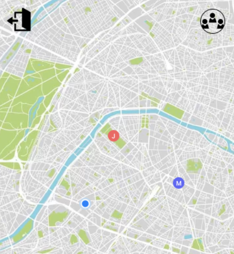                                                                                                     | Interactive map component that populates the user’s friends locations according to their latitude and longitude. Map allows for user interaction through zoom and xy movement. | JSON Object of the current user’s friends passed from the friendsConnector. <br/><br/><code>{<br/>&nbsp;&nbsp;\$uid : {<br/>&nbsp;&nbsp;&nbsp;&nbsp;name: String,<br/>&nbsp;&nbsp;&nbsp;&nbsp;email: String, <br/>&nbsp;&nbsp;&nbsp;&nbsp;location: firebase.Geopoint<br/>&nbsp;&nbsp;}<br/>}<code> | Create a marker with friend’s name and color on the map based off friends’ locations.                                                                                                                                                                                        | Matthew |
| friendList       | 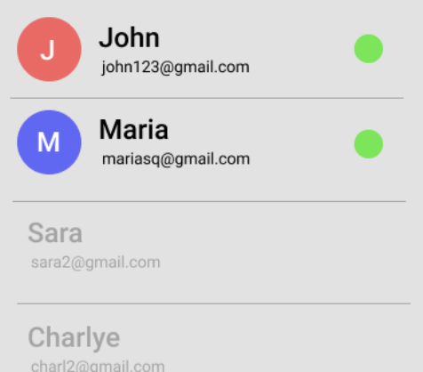                                                                                | Friend list provides the user with a list format of their current friends. The friend list shows active and friends.                                                           | JSON Object of the current user’s friends passed from the friendsConnector. <br/><br/><code>{<br/>&nbsp;&nbsp;\$uid : {<br/>&nbsp;&nbsp;&nbsp;&nbsp;name: String,<br/>&nbsp;&nbsp;&nbsp;&nbsp;email: String, <br/>&nbsp;&nbsp;&nbsp;&nbsp;location: firebase.Geopoint<br/>&nbsp;&nbsp;}<br/>}<code> | Active User: On click, the map will zoom to the active user's location. <br/><br/>Inactive User: Does nothing on click                                                                                                                                                       | Matthew |
| currentUser      | 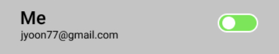 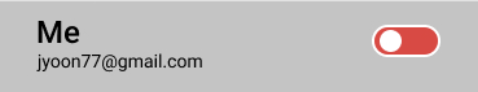 | The currentUser component is a view that shows the name, email, and location sharing status of the authenticated user.                                                         | Current user object: <br/><br/><code>{<br/>&nbsp;&nbsp;\$uid : {<br/>&nbsp;&nbsp;&nbsp;&nbsp;name: String,<br/>&nbsp;&nbsp;&nbsp;&nbsp;email: String<br/>&nbsp;&nbsp;}<br/>}<code>                                                                                                                  | On toggle on and off, the component will start and stop sending the user’s location to the server (firebase) in real-time.                                                                                                                                                   | Ben     |
| signOutModal     | 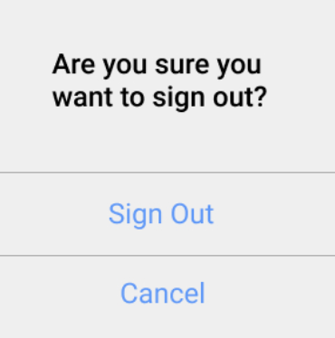                                                                          | The sign out modal provides user confirmation for signing out of the application.                                                                                              | N/A                                                                                                                                                                                                                                                                                                 | Sign Out: On Click, the user session will end then transition to Landing Page<br/><br/>Cancel: On Click, the modal will disappear and redisplay the map                                                                                                                      | Matthew |
| signOutButton    | 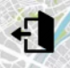                                                                       | This button opens the signOutModal described above.                                                                                                                            | N/A                                                                                                                                                                                                                                                                                                 | N/A                                                                                                                                                                                                                                                                          | Ben     |
| friendsButton    |                                                                        | This button opens the friendPreference screen described below.                                                                                                                 | N/A                                                                                                                                                                                                                                                                                                 | N/A                                                                                                                                                                                                                                                                          | Ben     |
| friendsConnector | Gets a list of current user’s friends from the server and passes them to the map and friendList                                               | The friendsModel will be a higher order component that handles the fetching of the user’s friends locations and passes them to the map and friendList.                         | Firebase User Authentication object.                                                                                                                                                                                                                                                                | Formatted JSON Object of the current user’s friends. <br/><br/><code>{<br/>&nbsp;&nbsp;\$uid : {<br/>&nbsp;&nbsp;&nbsp;&nbsp;name: String,<br/>&nbsp;&nbsp;&nbsp;&nbsp;email: String, <br/>&nbsp;&nbsp;&nbsp;&nbsp;location: firebase.Geopoint<br/>&nbsp;&nbsp;}<br/>}<code> | Matthew |

#### Friend Preference

The user accesses the Friend Preference screen when they press on the friend's Icon in the Home Screen. This screen has 2 major components, searchFriends and receivedRequests. These components will work together to enable the user to send requests to other users and respond to them. The user can return back to the home screen by pressing on the backButton component.

| Name            | UI                                                                                                                                                                                                                                                                               | Description                                                                                                                           | Inputs                                                                                                                                                                                                           | Outputs                                                                                                                                                                                                              | Owner   |
| --------------- | -------------------------------------------------------------------------------------------------------------------------------------------------------------------------------------------------------------------------------------------------------------------------------- | ------------------------------------------------------------------------------------------------------------------------------------- | ---------------------------------------------------------------------------------------------------------------------------------------------------------------------------------------------------------------- | -------------------------------------------------------------------------------------------------------------------------------------------------------------------------------------------------------------------- | ------- |
| searchFriends   | 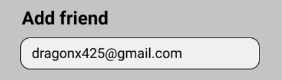 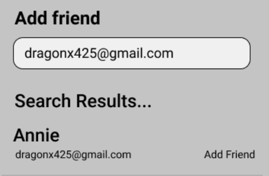 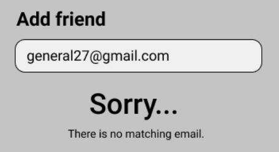 | The searchFriends view component will show a search bar to search friends and a search result to send a friend request.               | A friend’s email provided in the input field by the user                                                                                                                                                         | If a matching user email is found, the matching user's name. <br/><br/> If a matching user email is not found, an error: "Sorry… there is no matching email."                                                        | Ben     |
| receivedRequest | 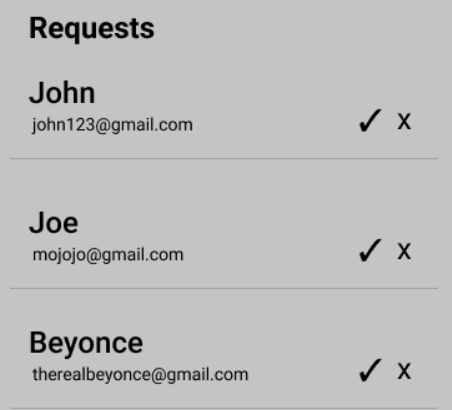                                                                                                                                                                                                 | The receivedRequest view component will show all received requests from other users. Each request will have an accept and deny button | JSON Object of the current user’s friends request. <br/><br/><code>{<br/>&nbsp;&nbsp;\$uid : {<br/>&nbsp;&nbsp;&nbsp;&nbsp;name: String,<br/>&nbsp;&nbsp;&nbsp;&nbsp;email: String<br/>&nbsp;&nbsp;}<br/>}<code> | Check: On click, add friend’s UID to my followers and following list. Query his/her UID in database and add my UID to his/her followers and following list. <br/><br/>X: On click, remove the request from the array | Charlye |
| backButton      |                                                                                                                                                                                                                    | This Button navigates the User back to the HomeScreen                                                                                 | N/A                                                                                                                                                                                                              | N/A                                                                                                                                                                                                                  | Charlye |

#### Sign Up

The sign up component will show up if the user had clicked on the sign up button from the sign in component. The sign up component will also have a sign in button that can redirect back to the sign in component.

| Name         | UI                                                                       | Description                                                                                                             | Inputs                                                    | Outputs                                                                                        | Owner  |
| ------------ | ------------------------------------------------------------------------ | ----------------------------------------------------------------------------------------------------------------------- | --------------------------------------------------------- | ---------------------------------------------------------------------------------------------- | ------ |
| signUpForm   | 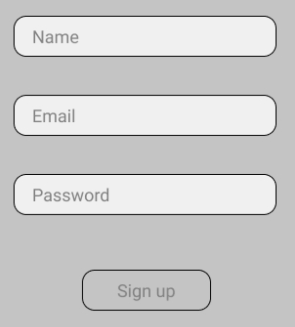           | The sign up component has a name, email, and password field that will register a new user, based off given credentials. | Takes in text input from name, email, and password field. | After clicking "Sign Up", the user will be authenticated and be redirected to the Home screen. | Joseph |
| signInButton |  | If user already has an account, user can click on the sign in button to go to the sign in component.                    | N/A                                                       | On click, navigate to the Sign In Screen.                                                      | Joseph |

#### Sign In

The sign in component will show up if the user has clicked the sign in button from the signup screen. The goal of the screen is to get the user to log in with their already created email and password.

| Name         | UI                                                                       | Description                                                                                                                            | Inputs                                             | Outputs                                                                                                                                                    | Owner  |
| ------------ | ------------------------------------------------------------------------ | -------------------------------------------------------------------------------------------------------------------------------------- | -------------------------------------------------- | ---------------------------------------------------------------------------------------------------------------------------------------------------------- | ------ |
| signInForm   | 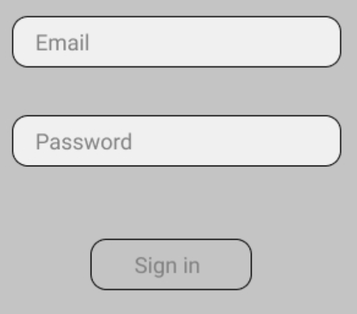           | Sign in component has an email and password field. After pressing sign in, the credentials will be authenticated and sign in the user. | Takes in text input from email and password field. | After clicking “Sign In”, establishes an authentication session and navigates user to the Home Screen, Otherwise return an error if credentials are wrong. | Joseph |
| signUpButton |  | If the user does not have an account, the user can click on the sign up button and be directed to sign up component.                   | N/A                                                | On click, navigate to the Sign Up Screen.                                                                                                                  | Joseph |

### Client Actions

There are many actions that the view components can invoke which get, create, and update data. The role of actions are to perform these data related activities and supply the view components with the correct data.

| Name                  | Function/Description                                                                                                                                                                                                                           | Inputs                                             | Outputs                                                                                                                                                                                                                                                                               | Owner   |
| --------------------- | ---------------------------------------------------------------------------------------------------------------------------------------------------------------------------------------------------------------------------------------------- | -------------------------------------------------- | ------------------------------------------------------------------------------------------------------------------------------------------------------------------------------------------------------------------------------------------------------------------------------------- | ------- |
| signIn                | Authenticate and create new user session                                                                                                                                                                                                       | Email, Password                                    | User Session                                                                                                                                                                                                                                                                          | Joseph  |
| signUp                | Register a new user and create a new user session                                                                                                                                                                                              | Name, Email, Password                              | User Session                                                                                                                                                                                                                                                                          | Joseph  |
| logOut                | Remove the current user session                                                                                                                                                                                                                | N/A                                                | N/A                                                                                                                                                                                                                                                                                   | Joseph  |
| getFriends            | Retrieve the current user’s friends and their names, emails, and locations                                                                                                                                                                     | N/A                                                | List of user objects including their name, email, and location <br/><br/><code>[<br/>&nbsp;&nbsp;\$uid : {<br/>&nbsp;&nbsp;&nbsp;&nbsp;name: String,<br/>&nbsp;&nbsp;&nbsp;&nbsp;email: String,<br/>&nbsp;&nbsp;&nbsp;&nbsp;location: firebase.Geopoint<br/>&nbsp;&nbsp;}<br/>]<code> | Matthew |
| getAuthenticatedUser  | Get the current logged in user’s name and email                                                                                                                                                                                                | User Session                                       | Current logged in user’s name and email                                                                                                                                                                                                                                               | Ben     |
| shareUserLocation     | Create a firebase real-time connection and start sending the current device’s location.                                                                                                                                                        | Stream of the current user’s location.             | N/A                                                                                                                                                                                                                                                                                   | Ben     |
| userSearch            | Get an existing user’s basic info using an email search.                                                                                                                                                                                       | User email                                         | If the user exists, return the user, else, return an error.                                                                                                                                                                                                                           | Ben     |
| sendUserFriendRequest | Using existing user’s basic info, add current user to list friend’s requests.                                                                                                                                                                  | Existing user info and current authenticated user. | Response of friend request HTTP request                                                                                                                                                                                                                                               | Ben     |
| getFriendRequests     | Retrieve the current users received requests object                                                                                                                                                                                            | Current authenticated user.                        | Array of user objects which each contain a name, uid and email <br/><br/><code>[<br/>&nbsp;&nbsp;\$uid : {<br/>&nbsp;&nbsp;&nbsp;&nbsp;name: String,<br/>&nbsp;&nbsp;&nbsp;&nbsp;email: String<br/>&nbsp;&nbsp;}<br/>]<code>                                                          | Charlye |
| rejectFriendRequest   | Remove the friend from current user’s list of friend requests                                                                                                                                                                                  | Current authenticated user. Friend UID             | Response from HTTP request                                                                                                                                                                                                                                                            | Charlye |
| acceptFriendRequest   | Establish friendship. This means appending Current User profile object in the other user's Friends Object. Appending the other user’s Profile into the current users' Friends Object. Remove the request form the Current User Requests object | Friend UID. Current authenticated user.            | Response from HTTP request. Establish Friendship between both users                                                                                                                                                                                                                   | Charlye |

### Server Components

The backend is a No-SQL database that supplies real-time capabilities and user authentication. The structure of this database is outlines as follows:

#### Schema

```{json}
locations : [
    $uid: {
        location: geopoint,
        name: String,
        email: String
    }
]

users: [
        $uid: {
            friends : [
                $uid : {
                    name: String
                    email: String
                }
            ],
            requests : [
                $uid:  {
                    name: String
                    email: String
                }
            ]
        }
    }
]
```

#### Rules

```{json}
“locations” {
    “$uid” : {
        .read : “auth != null && root.child(‘users/$uid/friends/auth.uid).exists()”
        .write : “auth.uid == $uid”
    }
}

“users”: {
    “$uid” : {
        “friends” {
            .read : “auth.uid == $uid”
            $uid2 : {
                .write : “auth != null && root.child(‘users’/$uid/requests/$uid2).exists()
            }
        }
        “requests” : {
            .read: “auth.uid == $uid”
            $uid2 : {
                .write: “auth.uid == $uid2”
            }
        }
    }
}
```
