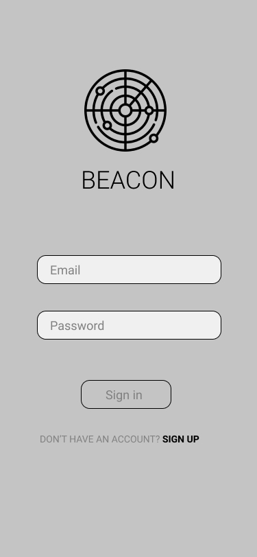
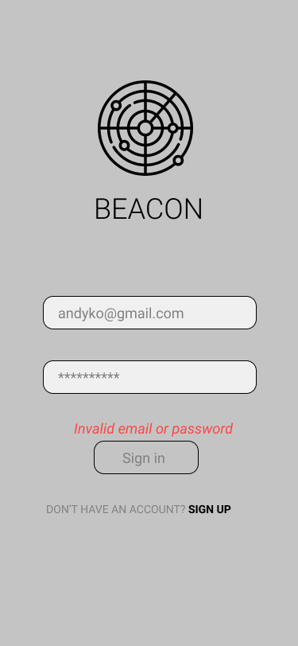
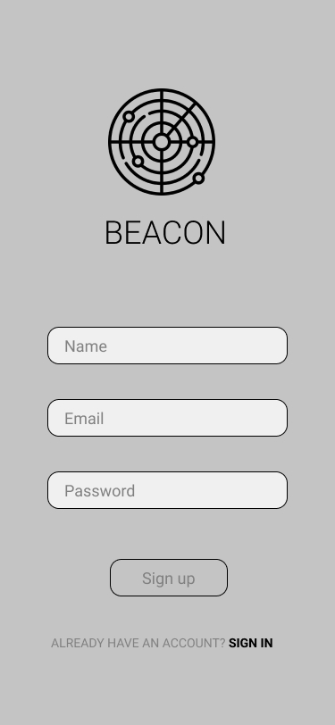
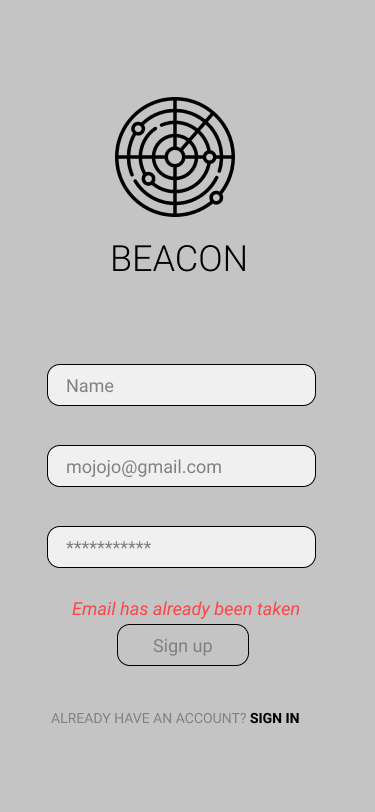
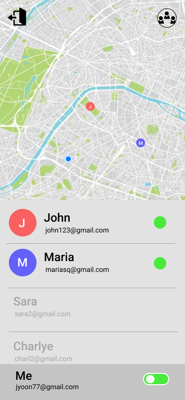
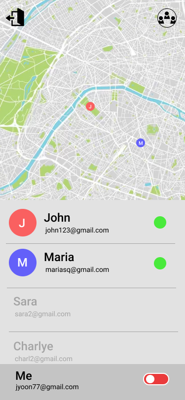
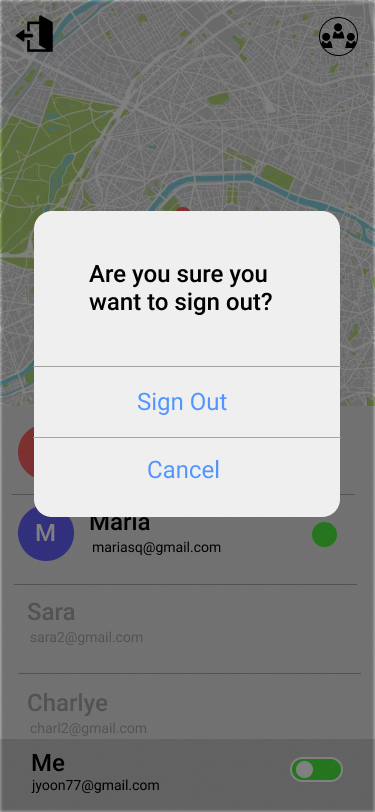
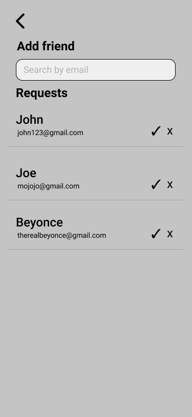

# Beacon

## Mission Statement

Stop wasting time. Make a connection.

## Problem

As students, we are often faced with empty time between classes. The process of coordinating, planning, and communicating with friends to fill these empty time slots is an organizationally annoying process for students. This process usually involves a myriad of online communication efforts like social media, instant messages, or even location sharing platforms.

## Solution

Our solution is to create a cross-mobile application that allows for on-demand location sharing to help students find friends and make better use of gaps in their schedules. 

The application will have a default “off-state” meaning users will turn on their location sharing only when they want to be found. 

Our project aims to implement a new type of on-demand location sharing to help connect students and find friends to make better use of gaps in their schedules.

## Team

- Leader: Ben
- Manager: Matthew
- Marketing: Ben / Charlye
- Project Management: Matthew
- Design: Joseph
- Engineering: Ben
- Support: Charlye

## Priorities

1. **Correctness** - Our application should be functional and achieve the requirements placed by the team and spec.
2. **Usefulness** - A user will only use Beacon if it is useful in their social lives.
3. **Usability** - The features should be usable in all aspects of the user’s experience.
4. **User efficiency** - Should be quick and simple when using app.
5. **Portability** - Our application should work on both Android and iOS.
6. **Privacy** - Our application is accessing user locations and should be stored securely.
7. **Security** - Our application contains user data and profiles and should be secure when managing user data.
8. **Learnability** - Our application should easily be able to set up a beacon and find other beacons.
9. **Consistency** - App will follow a design language and common design conventions
10. **Reliability** - The app and backend system should be up and usable, and not crash.
11. **Accessibility** - Any user should be able to perform the app’s functions.
12. **Robustness** - The app should not crash from unexpected errors. If the system cannot do a task, it should present the user with an error.
13. **Verifiability** - Our application will contain functional components that should be verifiable in accomplishing their functions accurately and repeatedly.
14. **Performance** - We just want our application to work.
15. **Interoperability** - The app will only work on Android and iOS devices
16. **Reusability** - Our goal is to build an app with a specific purpose, but users should be able to use it how they wish.
17. **Maintainability** - We don’t plan on revisiting this application.

## Design Req

### Landing Screen: Sign In

|         |            |
| :---: | :---: | 
| Landing: Sign In Default | Landing: Sign In w/ Errors|  

#### Landing Screen: Sign In
1. On launch, the application must show the ‘Sign in’ screen within two seconds if there is not an existing authenticated session.
2. If there is an existing authenticated session, the ‘Sign in’ screen must not be shown, and instead, the ‘User Home’ screen will be shown within two seconds.
3. The application must accept user text input into the Email field.
4. Email field must have a placeholder that says “Email.”
5. The application must accept user text input into the Password field.
6. Password field must have a placeholder that says “Password.”
7. The application must hide user text input into the Password field, by hiding the characters with asterisks.
8. The application must trigger a call to the authentication service when the user presses the ‘Sign In’ button and check if the inputted credentials match a registered user.
9. The application must display any errors in red above the ‘Sign In’ button that are returned from the authentication service after a failed authentication service call.
10. After a successful authentication service call, the application must redirect to the ‘User Home’ Screen within 5 seconds.
11. The application must change to the ‘Sign Up’ screen within 5 seconds, if the user clicks the ‘Sign Up’ link.

### Landing Screen: Sign Up

|         |            |
| :---: | :---: | 
| Landing: Sign Up Default | Landing: Sign Up w/ Errors|

#### Landing Screen: Sign Up
1. The application must accept user text input into the Name field.
2. Name field must have a placeholder that says “Name.”
3. The application must accept user text input into the Email field.
4. Email field must have a placeholder that says “Email.”
5. The authentication service will check if the inputted email is a valid email and will only register with a valid email or if the email has not been used already.
6. The application must accept user text input into the Password field.
7. Password field must have a placeholder that says “Password.”
8. The application must hide user text input into the Password field, by hiding the characters with asterisks.
9. The application must only accept passwords that are at least eight characters long, contains at least one number, and at least one uppercase and lowercase letter.
10. The application must not register the user if one of the fields are empty or contain invalid input, as mentioned above.
11. The application must trigger a call to the authentication service using the credentials entered by the user in the ‘Name’, ‘Email’, and ‘Password’ fields when the user presses the ‘Sign Up’ button. If successful, the credentials will be added to the database.
12. The application must display any errors in red above the ‘Sign Up’ button that are returned from the authentication service after a failed authentication service call.
13. After a successful authentication service call, the application must redirect to the ‘User Home’ Screen within two seconds.
14. The application must change to the ‘Sign in’ screen within two seconds after the user clicks the ‘Sign In’ link.

### User Home Screen

|         |            |    
| :---: | :---: | :---: | 
| User Home Screen (Location On) | User Home Screen (Location off)| Signout Popup| 

#### Signout Behavior Requirements

1. On application launch, the application must show the ‘User Home’ screen if there is an existing authentication session.
2. On application launch, the application must show the ‘Landing’ screen if there is not an existing authentication session.
3. When the user clicks the top left ‘Sign out’ icon, the application must display a modal within one second with two options (‘Sign out’ or ‘Cancel’) to confirm the user’s action.
4. When the user clicks the ‘Sign out’ button on the modal, the application must unauthenticate the current user and redirect to the ‘Landing’ Screen within two seconds.
5. When the user clicks the ‘Cancel’ button on the popup, the application must close the modal and re-display the ‘User Home’ screen.

#### Map Behavior

1. The software must display the current user on the map with the accuracy of the user device’s GPS.
2. The software must display the current user’s ‘friends’ with the accuracy of the user’s friend’s device’s GPS.
3. When a user’s friend’s beacon is on, they will be considered in the ‘active’ state and the software must make their marker displayed on the map and list them as ‘active’ in the user list.
4. When a user’s friend beacon is off, they will be considered in the ‘inactive’ state and the software must not display their marker on the user’s map and list them as ‘inactive’ in the user’s friend list.
5. The application must display ‘active’ users on the map with a circle marker of a randomly generated color and the user’s first initial in the middle.
6. The application must display users who have their beacon ‘ON’ above users who have their beacon ‘OFF’ in the user list.
7. The application must capture the current user’s location and share to all of the user’s followers if they toggle the beacon form ‘inactive’ to ‘active’
8. The application must not display the current user’s location to any of their followers if the current user toggles their beacon from ‘active’ to ‘inactive’.
9. The user’s current location must not be sent to any external data storage solutions when the Beacon toggle is off.
10. The user’s current location must be shared with the user’s friends when the Beacon toggle is on.
11. When the Home screen is loaded, the application must call the database and load all of the current user ‘active’ friend’s locations. 
12. The software must redirect the screen to the ‘Friend Preference’ screen if the ‘Friend Preference’ icon is clicked.

### Friend Preference Screen

|         | ")           | ")   
| :---: | :---: | :---: | 
| Friend Preference Screen | Friend Preference Screen (with Results)| Friend Preference Screen (No Results)|  

#### Friend Preference Screen

1. User must be able to navigate to this screen from the ‘User Home’ screen, after pressing the request button at the top right within two seconds.
2. The application must display all friend requests sent from other users on the application.
3. Each request must display the email and name of the user that is requesting to be friends.
4. Each request must display buttons to enable the user to accept or deny a request.
5. The request must disappear when the user denies a friend request.
6. The request must disappear when the user accepts a friend request. The newly accepted friend must be added to the current list of friends the user has, which will be visually shown in the friend's list on the ‘User Home’ screen. 
7. The application displays a search bar to enable the user to search for another user by email.
8. The search bar placeholder must say “search by email.”
9. The search bar must accept user text input. 
10. The application must display below the search bar “Sorry there’s no matching email,” if there is no email in the database that matches the search query.
11. If the query has matching emails, the application must display the possible emails that match the query, alongside the corresponding display name. 
12. A button must also be displayed next to the email and name that says “Add friend” to enable the user to send an invite to the user they searched.
13. The application must display a toast confirmation that the invite was sent, within one second.
14. The user must be able to return to the home screen within one second, using a back button at the top left corner.
