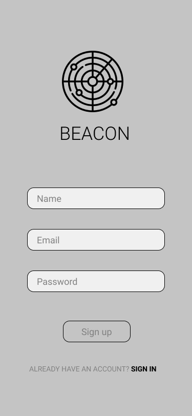
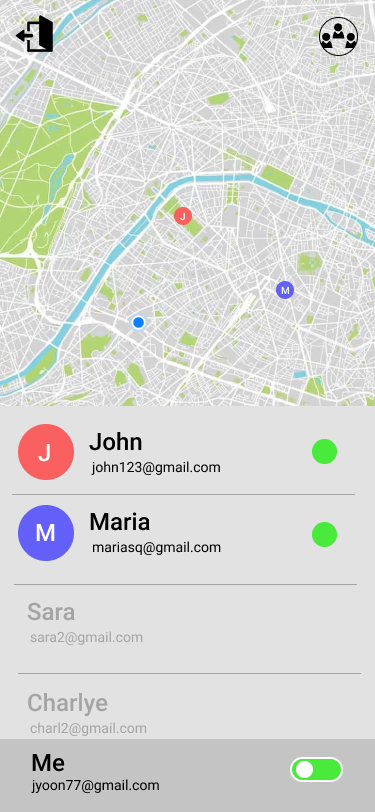
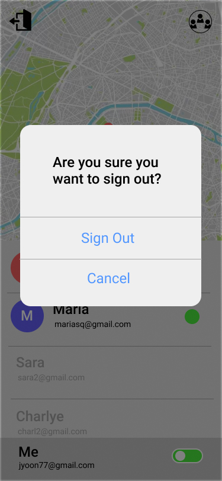
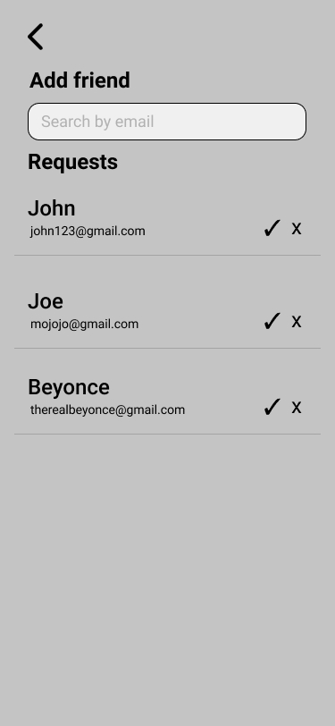

# Beacon

## Mission Statement

Stop wasting time. Make a connection.

## Problem

As students, we are often faced with empty time between classes. The process of coordinating, planning, and communicating with friends to fill these empty time slots is an organizationally annoying process for students. This process usually involves a myriad of online communication efforts like social media, instant messages, or even location sharing platforms.

## Solution

Our solution is to create a cross-mobile application that allows for on-demand location sharing to help students find friends and make better use of gaps in their schedules. 

The application will have a default “off-state” meaning users will turn on their location sharing only when they want to be found. 

Our project aims to implement a new type of on-demand location sharing to help connect students and find friends to make better use of gaps in their schedules.

## Team

- Leader: Ben
- Manager: Matthew
- Marketing: Ben / Charlye
- Project Management: Matthew
- Design: Joseph
- Engineering: Ben
- Support: Charlye

## Priorities

1. **Correctness** - Our application should be functional and achieve the requirements placed by the team and spec.
2. **Usefulness** - A user will only use Beacon if it is useful in their social lives.
3. **Usability** - The features should be usable in all aspects of the user’s experience.
4. **User efficiency** - Should be quick and simple when using app.
5. **Portability** - Our application should work on both Android and iOS.
6. **Privacy** - Our application is accessing user locations and should be stored securely.
7. **Security** - Our application contains user data and profiles and should be secure when managing user data.
8. **Learnability** - Our application should easily be able to set up a beacon and find other beacons.
9. **Consistency** - App will follow a design language and common design conventions
10. **Reliability** - The app and backend system should be up and usable, and not crash.
11. **Accessibility** - Any user should be able to perform the app’s functions.
12. **Robustness** - The app should not crash from unexpected errors. If the system cannot do a task, it should present the user with an error.
13. **Verifiability** - Our application will contain functional components that should be verifiable in accomplishing their functions accurately and repeatedly.
14. **Performance** - We just want our application to work.
15. **Interoperability** - The app will only work on Android and iOS devices
16. **Reusability** - Our goal is to build an app with a specific purpose, but users should be able to use it how they wish.
17. **Maintainability** - We don’t plan on revisiting this application.

## Design Spec

### Landing Screen

|         |            |
| :---: | :---: | 
| Landing Default | Landing w/ Errors|  

#### User Encounter:

Landing screen is displayed when a current user is not actively signed into the application. The screen is bypassed if a current user is logged into the application and directly forwarded to the ‘User Home’ screen. There are three user end results at this page: 

1. Enter login information → Login Success → Navigate to ‘User Home Screen’
2. Enter login information → Login Failure → Landing Screen with Error display
3. Tap ‘Sign up’ link → Navigate to Sign Up Screen

#### Inputs:

1. Email Input 
    - Component: Material UI Email Input
    - Placeholder: “Email”
2. Password Text Input
    - Component: Material UI Password Input
    - Placeholder: “Password”
3. Sign in button
    - Component: Material UI Button
    - Triggers a signup attempt using text input from the ‘Email text input’ and ‘Password text input’
4. Sign up button
    - Component: Material UI Button
    - Triggers navigation to ‘Sign Up Screen’

#### User Stories:
1. As a user, when I open the application for the first time I will be displayed the Landing Screen with inputs for user login.
2. As a user, when I have previously signed into the application (& session still saved), I will bypass the Landing Screen and be directly navigated to the ‘User Home Screen’.
3. As a user, I can login to the application using my email and password. After entering my user information and clicking submit, my information will be verified and I will log in and be navigated to the ‘User Home Screen’.
4. As a user, if I input incorrect or invalid data to the text inputs and click the ‘Sign in’ button I will be prompted with error messages of the authentication failure.
5. As a user, if I do not already have a Beacon account, I can click the ‘Sign Up’ button and be navigated to the ‘Sign Up Page’

####  Algorithmic functionality:
On login, the app will authenticate the credentials against firebase auth.

#### Errors: [Will show above ‘Sign in’ button]
“Invalid email or password”

### Signup Screen

|         |            |
| :---: | :---: | 
| Landing Default | Landing w/ Errors|  

#### User Encounter:

User is displayed the ‘Sign Up’ screen after clicking the ‘Sign Up’ button located on the ‘Landing Screen’. There are 3 user flows from this screen.

1. Enter valid signup information → Login Success → Navigate to ‘User Home Screen’
2. Enter invalid signup information → Login Failure → Sign Up Screen with Errors (see errors)
3. Select ‘Sign in’ button → Navigate to ‘Landing Screen’

#### Inputs:

1. Name Input 
    - Component: Material UI Text Input
    - Placeholder: "Name"
2. Email Text Input
    - Component: Material UI Email Input
    - Email Text Input
3. Password Text Input
    - Component: Material UI Password Input
    - Placeholder: “Password”
4. Sign up button
    - Component: Material UI Button
    - Triggers navigation to ‘Sign Up Screen’

#### User Stories:
1. As a new user to Beacon, I can use the ‘Sign Up’ screen to create an account on the platform.
2. As a new user to Beacon, I can input my credential into the inputs (Name, Email, Password), click sign up, and on success be navigated to the ‘User Home’ screen.
3. As a new user to Beacon, If I enter invalid information into the inputs (i.e. email is not an email, see Errors for full list) and click the ‘Sign up’ button I will be prompted with an error message (see errors) of the account creation failure.
4. As a user of Beacon, if I already have an account, I can click the ‘Already Have an Account’ link and be navigated to the ‘Landing’ Screen.

####  Algorithmic functionality:
On signup, we will create an account with firebase using the email and password. We will also create a user with the given name who is linked to the created account.

#### Errors: [Will display above ‘Sign Up’ button]
1. “Email has already been taken”
2. “Password doesn’t meet requirements”
3. “Please fill out all fields”

### User Home Screen

|         |            |    
| :---: | :---: | :---: | 
| User Home Screen (Location On) | User Home Screen (Location off)| Signout Popup|  

#### User Encounter:

User Home screen is displayed when a current user is actively signed into the application. When the application opens and a user is logged in, the user will bypass the ‘Landing Screen’ and directly be navigated to the User Home Screen. 

1. Click 'Friend Preference' Button (top right) → Navigate to ‘Friend Preference’
2. Click ‘Sign Out’ icon (top left) → User Popup appears → User clicks logout button → Redirect to ‘Landing Page’
3. Click 'Sign Out' icon (top left) → User Popup appears → User clicks 'Cancel' option → Popup closes → User Home Screen

#### Inputs:

1. Beacon Toggle (Bottom Right)
     - Component: Component: Material UI Radio Toggle
    - Action: When switched on (right), location is active for user. When switched off (left), location is deactive for user.
2. Friend Preference Button/Icon (top right)
    - Component: Material UI Button w/ center 'user' icon
    - Action: Navigates to 'Friend Preference' Screen
3. Signout Button/Icon (top left)
    - Component: Material UI Button w/ center 'signout' icon
    - Action: Triggers confirm signout popup
4. Map
    - Component: Google Maps API Component
    - The map will consist of ⅔ of the total screen and be completely intractable including drag and pinch to zoom gestures. User’s friends (with Beacons on) will be displayed on the map with markers of varying color and user’s first initial in the center.
5. User List (List of User Elements)
    - Component: Custom build list widget
    - User list will consist of ⅓ of the total screen and be located below the map. Overflowed Users will be viewable via scrolling of the list.
6. User Element (Active)
    - User list element will display User's name and email bolded. Circle with user's first initial is displayed to the left cooresponding to the 'beacon' shown on the map. Green icon on right indicates beacon 'on'.
7. User Element (In-active)
    - User list element (in-active) will display the user’s name and email. The overall appearance of the Element will be ‘muted’ / opacity decreased.
8. Signout Confirm Popup
    - Component: Native 'Popup' component via OS.
    - Prompts the user if they want to signout. Contains 2 inputs: Signout and Cancel.
9. Signout 'Signout' option
    - Action: Triggers signout of user. On signout success, because no active user is on the application, redirect to 'Landing' screen.
10. Signout 'Cancel' option
    - Action: Cancels signout flow, closes popup and redirects back to 'User Home' Screen.

#### User Stories:
1. As a user, when I reopen and have an active ‘session’ on the application I will bypass the ‘Landing Page’ and be immediately displayed the ‘User Home’ screen.
2. As a user, I can use the ‘User Home’ screen to view all of my friend’s locations on the map.
3. As a user, I can use the ‘User Home’ screen’s user list to view all of my current friends.
4. As a user, I can use the ‘User Home’ screen to see which of my ‘Friends’ Beacons are active and who’s are off.
5. As a user, when I want to add a friend, I can click the top right ‘Friend Preference’ button and navigate to the ‘Friend Preference’ screen.
6. As a user, when I want to signout of the application I can click the top left 'Signout' button. A popup appears to confirm my signout. Clicking the 'Signout' option signs me out of the app and redirects to 'Landing' Screen.
7. As a user, when I want to signout of the application I can click the top left 'Signout' button. A popup appears to confirm my signout. Clicking the 'Cancl' option closes the popup and shows the 'User Home' screen.
8. As a user, when I want to turn on my location I can tap or 'swipe' the radio button to the right.
9. As a user, if I am sharing my location, I can turn off my location by tapping or 'swiping' the radio button to the left.

####  Algorithmic functionality:
When a user turns off their location sharing, it will remove the user’s location field from the real-time database. This will prevent security issues from stale location data.

A user can sign out, which will sign out of the current authentication instance.

### Friend Preference Screen

|         | ")           | ")   
| :---: | :---: | :---: | 
| Friend Preference Screen | Friend Preference Screen (with Results)| Friend Preference Screen (No Results)|  

#### User Encounter:

To the navigate to the 'Friend Preference' screen the user has to press on the ‘Friend Preference' button in the top right corner of the ‘User Home’ screen. There is only one way to navigate away of the 'Friend Preference' screen: 

1. Click back button at top left → Navigate to 'User Home' screen

#### Inputs:

1. Search Input
    - Component: Material UI TextField
    - Placeholder: “Search by Email”
2. Back Button
    - Component: Material UI Button
    - Action: Navigates to ‘User Home’ screen
3. User List of received Requests (Custom Widget)
    - Display 'User Request' elements in a scrollable list.
4. User Request Element
    - Display a pending user requester's name, email, and a confirm or reject button.
5. User Request Element Confirm Button
    - Component: Material UI button w/ check icon.
    - Action: Clicking the confirm button will grant the request access to your beacon.
6. User Request Element Reject Button
    - Component: Material UI button w/ x icon.
    - Action: Clicking the reject button will delete the request and it the User 
7. User Search Result Element
    - Component: Custom widget, will display results from query including each result's Name, Email, and add friend button.
8. User Search Result Element Add Friend Button
    - Component: Material UI Button with inner text.
    - Action: Sends a request to the user.

#### User Stories:
1. As a signed in user, I can use the 'Friend Preference' screen to send requests and reply to requests from other users.
2. As a user, I can search a user with their email, query results will display beneath the search input. 
3. I should be able to see similar users as I type the email.
4. As a user, I should see query results as I type and be prompted if there are no results.
5. As a user, I can click the 'Add Friend' button from the list of query results (if any) and send a friend request to the user.
5. As a user, I should see all the requests that have been sent to me and have the opportunity to accept or deny them.
6. As a user, I should be able to click the back button in the top left of the screen and return to the ‘User Home' Screen

####  Algorithmic functionality:

##### Friend Preference Screen Base
This screen will retrieve a list of the user’s friend requests and each user’s name and email. 

On accept, the user of the request will be  added to the current user’s friend list and removed from the user’s request list. 

On decline, the user will just be removed from the user’s request list.

##### Friend Preference Screen Seach Results
When a user types in an email, it will search through the global list of users for an existing user with the given email. 

If a user is found it will display the name, email, and a button to “Add Friend”.
When the button is tapped, we will add the current user to the friend’s list of requests.

If none is found, it will present the user with a message that says “Sorry… There is no matching email.”
